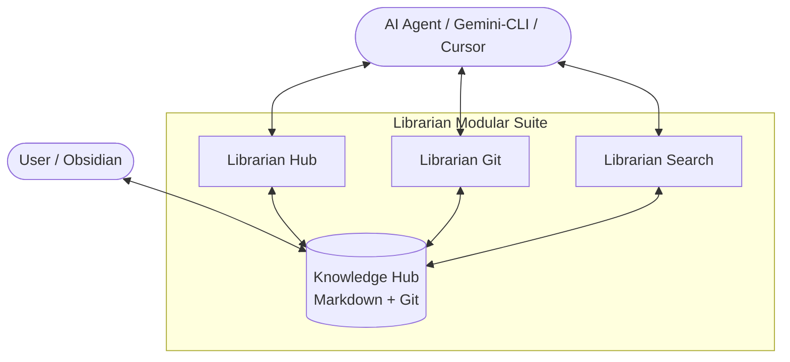

# 📚 Librarian MCP: The Atomic Knowledge OS (v5.0.0)

**Librarian MCP** is an intelligent orchestration layer for your personal knowledge base, inspired by Andrej Karpathy's [LLM Wiki vision](https://gist.github.com/karpathy/442a6bf555914893e9891c11519de94f). It transforms a simple folder of Markdown files into a dynamic, structured, and safe "digital brain" accessible via the **Model Context Protocol (MCP)**.

---

## 🏗️ Architecture: Modular & Layered

Librarian v5/v6 features a professional **Clean Architecture**. Every microservice is split into three layers:
- 📂 **`core/`**: Pure business logic (Manager classes) decoupled from protocols.
- 📂 **`bootstrap/`**: Self-healing initialization and migration routines.
- 📄 **`index.ts`**: Thin orchestrators for the MCP SDK.



---

## 🏛️ The Two-Branch Protocol (State Machine)

Librarian v5 treats your knowledge hub as a robust state machine. To ensure architectural integrity, we enforce the **Two-Branch Protocol**:

1.  **`master` (Crystallized)**: The immutable source of truth. Stable, indexed, and ready for consumption.
2.  **`draft` (Active Session)**: The ONLY legal space for modifications. All AI interactions accumulate here.

**Consolidation sessions** automatically detect "illegal" branches and merge them into the `draft` using the **Accumulative Merge** strategy.

---

## 🛡️ Core Protocols

### 🔄 Accumulative Merge
Librarian never destroys knowledge during conflicts. Instead of traditional Git merge conflicts, we use **Non-Destructive Markdown Callouts**. Conflicting versions are wrapped in GitHub-compatible blocks:
> [!CAUTION] CONFLICT: Draft vs Incoming
> **Version A (Draft):** ...
> **Version B (Incoming):** ...

### 🧹 Smart Curation Protocol
The Hub root directory is kept strictly clean. Librarian classifies stray files into:
- **GHOSTS**: Redundant empty files of existing nodes (automatically deleted).
- **NODES**: Misplaced wiki entries with YAML metadata (moved to `wiki/`).
- **SOURCES**: Raw data or text logs (moved to `raw/`).

---

## 🏗️ The Microservice Suite

### 🛡️ Librarian Hub (`alsokolov2/librarian-hub-mcp`)
The **Hub** is the guardian of structure.
- **Smart Audit**: Classifies and curates root directory items.
- **Validation**: Enforces naming conventions and YAML requirements.
- **Templates**: Automatic project and entity scaffolding.

### 📜 Librarian Git (`alsokolov2/librarian-git-mcp`)
The **Git** service is the guardian of state.
- **State Control**: Manages the Master/Draft lifecycle.
- **Atomic Commits**: Structured, auditable change history.

### 🧠 Librarian Search (`alsokolov2/librarian-search-mcp`)
The **Search** service is the intellectual layer.
- **Semantic Search**: Fully local RAG (Transformers.js + LanceDB).
- **Global Indexing**: Unified searchable map of your digital brain.

---

## 🚀 Quick Start (Docker Compose)

```yaml
services:
  librarian-hub:
    image: alsokolov2/librarian-hub-mcp:latest
    container_name: librarian-hub
    user: "1000:1000"
    volumes:
      - /path/to/your/notes:/app/knowledge-hub
    environment:
      - KNOWLEDGE_HUB_PATH=/app/knowledge-hub
    stdin_open: true
    tty: true
    restart: unless-stopped

  librarian-git:
    image: alsokolov2/librarian-git-mcp:latest
    container_name: librarian-git
    user: "1000:1000"
    volumes:
      - /path/to/your/notes:/app/knowledge-hub
    environment:
      - KNOWLEDGE_HUB_PATH=/app/knowledge-hub
    stdin_open: true
    tty: true
    restart: unless-stopped
```

---

## 🛠️ Development
```bash
npm install
npm run build
npm test
npm run release
```

---

## ⚖️ License
MIT License. Created with ❤️ by [AlSokolov2](https://github.com/AlSokolov2).
