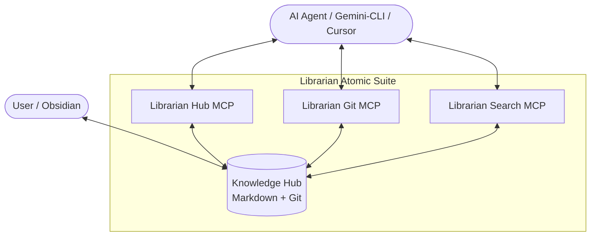

# 📚 Librarian MCP: The Atomic Knowledge OS (v4.0.0)

**Librarian MCP** is an intelligent orchestration layer for your personal knowledge base, inspired by Andrej Karpathy's [LLM Wiki vision](https://gist.github.com/karpathy/442a6bf555914893e9891c11519de94f). It transforms a simple folder of Markdown files into a dynamic, structured, and safe "digital brain" accessible via the **Model Context Protocol (MCP)**.

---

## 🏗️ Architecture



---

## 🏛️ v4: The Librarian Monopoly Architecture

Librarian v4 introduces a strict **Knowledge Integrity Protocol**. At its heart is **Law #0**: 

> *Any modification to the Knowledge Hub (excluding the `raw/` directory) MUST be performed exclusively through Librarian MCP tools. Manual manipulation or use of generic file tools is strictly forbidden.*

This architecture ensures that your "digital brain" remains healthy, consistent, and fully versioned by forcing all AI agents to adhere to the same high structural standards.

---

## 🏗️ The Microservice Suite

### 🛡️ Librarian Hub (`alsokolov2/librarian-hub-mcp`)
The **Hub** is the guardian of your files and the master of structure.
- **FS Health**: Enforces naming conventions and audits structural integrity.
- **Auto-Compliance**: Automatically seeds `.librarian/INSTRUCTIONS.md` and templates.
- **Self-Healing**: Marker-based system protects core rules while allowing local settings.

### 📜 Librarian Git (`alsokolov2/librarian-git-mcp`)
The **Git** service is the guardian of versions.
- **Safety**: Isolates changes in `draft/*` branches.
- **Primitives**: Provides atomic Git operations for AI agents.

### 🧠 Librarian Search (`alsokolov2/librarian-search-mcp`)
The **Search** service is the intellectual layer.
- **Semantic Search**: Fully local AI (Transformers.js + LanceDB).
- **Keyword Search**: Blazing fast regex-based lookup.

---

## 🚀 Quick Start (Docker Compose)

The easiest way to run the suite is using Docker Compose:

```yaml
services:
  librarian-hub:
    image: alsokolov2/librarian-hub-mcp:latest
    container_name: librarian-hub-mcp
    user: "1000:1000" # Run 'id -u' and 'id -g'
    volumes:
      - /path/to/your/notes:/app/knowledge-hub
    environment:
      - KNOWLEDGE_HUB_PATH=/app/knowledge-hub
    stdin_open: true
    tty: true
    restart: unless-stopped

  librarian-git:
    image: alsokolov2/librarian-git-mcp:latest
    container_name: librarian-git-mcp
    user: "1000:1000"
    volumes:
      - /path/to/your/notes:/app/knowledge-hub
    environment:
      - KNOWLEDGE_HUB_PATH=/app/knowledge-hub
    stdin_open: true
    tty: true
    restart: unless-stopped

  librarian-search:
    image: alsokolov2/librarian-search-mcp:latest
    container_name: librarian-search-mcp
    user: "1000:1000"
    volumes:
      - /path/to/your/notes:/app/knowledge-hub
    environment:
      - KNOWLEDGE_HUB_PATH=/app/knowledge-hub
    stdin_open: true
    tty: true
    restart: unless-stopped
```

---

## 🔒 Hybrid Git Standard
Librarian implements a **"Text-Heavy, Binary-Light"** standard:
*   **Tracked**: `.md`, `.txt`, `.json`, `.php`, `.js`, `.py`, `.yaml`, etc.
*   **Ignored**: `.pdf`, `.png`, `.jpg`, `.zip` and UI settings (`.obsidian/`).

---

## 🎓 Knowledge Manager Skill
This repository includes a **Gemini CLI Skill** located in `.gemini/skills/knowledge-manager`. Activate it to help the AI agent coordinate the ecosystem effectively.

---

## 🛠️ Development & Releases
We use **Conventional Commits** and automated release management.

```bash
# Install dependencies
npm install

# Build all microservices
npm run build

# Run tests
npm test

# Prepare a release (bumps version, updates CHANGELOG.md)
npm run release
```

---

## ⚖️ License
MIT License. Created with ❤️ by [AlSokolov2](https://github.com/AlSokolov2).
