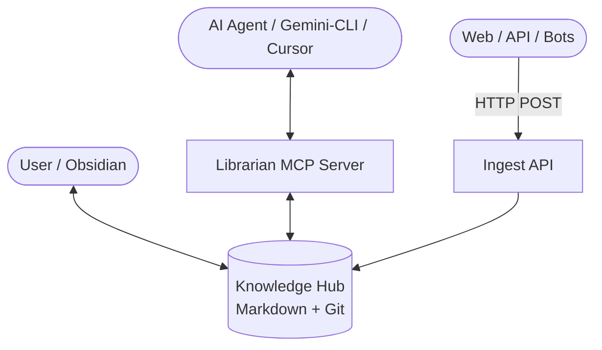

# 📚 Librarian MCP: The Personal Knowledge OS

**Librarian MCP** is an intelligent orchestration layer for your personal knowledge base, inspired by Andrej Karpathy's [LLM Wiki vision](https://gist.github.com/karpathy/442a6bf555914893e9891c11519de94f). It transforms a simple folder of Markdown files into a dynamic, structured, and safe "digital brain" accessible to any AI agent via the Model Context Protocol (MCP).

Unlike traditional RAG systems that merely retrieve fragments, Librarian MCP enables **Iterative Synthesis**—where AI acts as an active editor, maintaining structure, cross-links, and ground truth across multiple projects.

---

## 🚀 Key Features

- 🛡️ **Safety-First (Drafts Workflow)**: AI never modifies your "master" branch directly. All changes are isolated in `draft/*` Git branches for your review and approval.
- 🧠 **Local Semantic Intelligence**: Fully offline vector search using `transformers.js` (all-MiniLM-L6-v2) and `LanceDB`. No external API keys or internet connection required for search.
- 📏 **Automated Rule Enforcement**: Enforces naming conventions (`Capitalized_Snake_Case`) and mandatory metadata (YAML sources/tags) at the protocol level to prevent data entropy.
- 🗺️ **Autonomous Project Mapping**: Automatically scans your directory structure and maintains a global index of all projects and knowledge nodes.
- 🔌 **Ingest API**: Optional HTTP service to feed data from browser extensions, bots, or CLI tools directly into your Hub's `raw/` directory.
- 🐳 **Portable & Private**: Runs as a lightweight Docker container. Your data stays on your machine, always under Git version control.

---

## 🏗️ Architecture



---

## 🛠️ Quick Start

### 1. Prerequisites
- Docker & Docker Compose
- A folder to serve as your Knowledge Hub (Librarian will initialize it if empty).

### 2. Configuration
1. Clone this repository:
   ```bash
   git clone https://github.com/AlSokolov2/librarian-mcp.git
   cd librarian-mcp
   ```
2. Create your `.env` file:
   ```bash
   cp .env.example .env
   ```
3. Configure the following variables in `.env`:
   - `KNOWLEDGE_HUB_PATH`: Absolute path to your notes folder.
   - `USER_ID` & `GROUP_ID`: Run `id -u` and `id -g` in your terminal to get these (prevents permission issues).

### 3. Launch
```bash
docker compose up -d
```

### 4. Connect to your MCP Client
Add Librarian to your client configuration (e.g., `~/.gemini/settings.json`):

```json
"mcpServers": {
  "librarian": {
    "command": "docker",
    "args": ["exec", "-i", "librarian-mcp", "node", "build/index.js"]
  }
}
```

*Note: If you prefer to use the pre-built image from Docker Hub:*
```json
"args": ["run", "-i", "--rm", "alsokolov2/librarian-mcp:latest"]
```

---

## 📖 Tools Reference

| Tool | Description |
| :--- | :--- |
| `search_knowledge` | Classic keyword search using `grep`. Fast and precise. |
| `semantic_search` | Contextual search by meaning. Finds related concepts even without keyword matches. |
| `read_file` | Reads any file from the Hub (wiki, raw, or meta). |
| `write_file` | Writes content to a new Git branch (`draft/*`). Applies templates and validates rules. |
| `list_drafts` | Lists all pending AI-generated drafts. |
| `approve_draft` | Merges a specific draft branch into `master` and deletes the branch. |
| `discard_draft` | Deletes a draft branch without saving changes. |
| `reindex_all` | Re-builds the local vector database for semantic search. |
| `update_project_map` | Synchronizes `meta/PROJECT_MAP.md` with the current folder structure. |

---

## 📏 Governance & Rules
Librarian enforces the **"Knowledge Hub Constitution"**:
1. **Naming**: Files in `wiki/` must be `Capitalized_Snake_Case.md`.
2. **Grounding**: Every wiki page must have a `sources` array in its YAML header pointing to files in `raw/`.
3. **Structure**: Every page must start with an `# H1 Header`.
4. **History**: Every change is committed to Git with an automated summary.

*These rules are configurable via `meta/config.json` inside your Hub.*

---

## 🔌 Ingest API Usage
If enabled (`ENABLE_INGEST_API=true`), you can send data to the Hub via HTTP:

```bash
curl -X POST http://localhost:3000/ingest \
     -H "Content-Type: application/json" \
     -H "x-api-key: your-secret-key" \
     -d '{
       "filename": "meeting_notes.txt",
       "content": "Raw text from the meeting..."
     }'
```

---

## ⚖️ License
MIT License. Created with ❤️ by [AlSokolov2](https://github.com/AlSokolov2).
